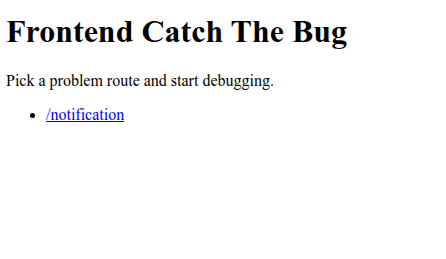

# Frontend Catch The Bug

This repository is for developers who want to master frontend debugging like a pro.

Each challenge contains intentionally tricky, real-world style bugs. Your goal is to reproduce the issue, reason about the root cause, and implement a clean fix.

## Branch Workflow

- main branch: problem version (buggy implementation)
- solution branch: solved version (reference fix)

Use this flow:

1. Checkout main and reproduce the bug.
2. Try fixing it yourself.
3. Compare your approach with the solution branch.

## Challenge Format

- Each challenge starts from a buggy implementation in the main branch.
- Each solved reference lives in the solution branch.
- New challenges will be added over time.

## Getting Started

Install dependencies and run the app:

```bash
npm install
npm run dev
```

Open http://localhost:3000 in your browser.



## Learning Focus

- Reproducing frontend bugs reliably
- Debugging async state and rendering issues
- Isolating root causes under real UI constraints
- Implementing minimal, high-signal fixes
